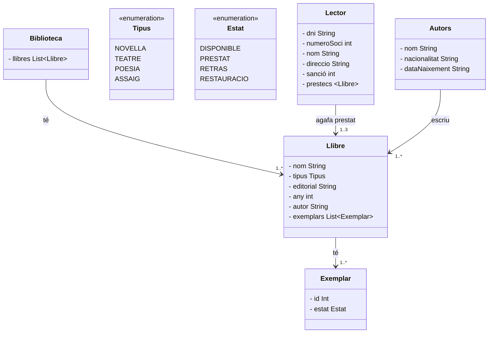

```mermaid

classDiagram

    class Biblioteca {
        - llibres List~Llibre~
    }

    class Llibre {
        - nom String
        - tipus Tipus
        - editorial String
        - any int
        - autor String
        - exemplars List~Exemplar~
    }
    
    class Tipus {
        <<enumeration>>
        NOVELLA
        TEATRE
        POESIA
        ASSAIG
    }

    class Exemplar {
        - id Int
        - estat Estat
    }

    class Estat {
        <<enumeration>>
        DISPONIBLE
        PRESTAT
        RETRAS
        RESTAURACIO
    }

    class Autors {
        - nom String
        - nacionalitat String
        - dataNaixement String
    }

    class Lector {
        - dni String
        - numeroSoci int
        - nom String
        - direccio String
        - sanció int
        - prestecs ~Llibre~
    }

    Biblioteca --> "1..*" Llibre :té
    Lector --> "1..3" Llibre :agafa prestat
    Autors --> "1..*" Llibre :escriu
    Llibre --> "1..*" Exemplar :té

```
